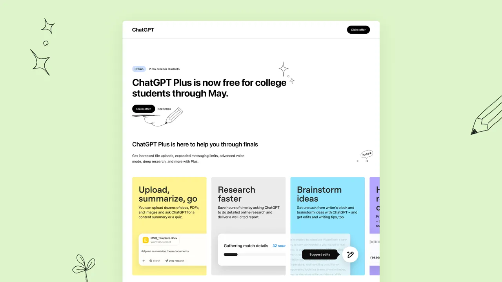

ChatGPT Plus is free for college students in the US and Canada through May!” Sam Altman wrote [on X](https://xcancel.com/sama/status/1907862982765457603). Signing up for the deal is very easy. Just head over to [this page on the OpenAI site](https://help.openai.com/en/articles/10968654-student-discounts-for-chatgpt-plus-us-canada) and follow the instructions to verify that you’re eligible. OpenAI uses [SheerID](https://shop.sheerid.com/studentdeals/) for verification, so students will likely already know if they’re eligible since it’s the same service used by other companies. Once you’ve determined that you’re eligible, you’ll just need to sign up for an account using your school email address.

# 🎓 How to Access ChatGPT Plus for Free as a Student

Great news for students in the U.S. and Canada! [OpenAI](https://www.openai.com) is offering **ChatGPT Plus**—normally $20/month—**free for two months**.  
This promotion runs from **March 31 to May 31, 2025** ([OpenAI Help](https://help.openai.com/en/articles/10968654-student-discounts-for-chatgpt-plus-us-canada?utm_source=chatgpt.com)).

## ✅ Eligibility Criteria

- Must be a **full-time or part-time student** at a degree-granting institution in the U.S. or Canada.
- Verification is done through **SheerID**, which may require:
  - School email address
  - Student ID
  - Enrollment documents

## 🚀 How to Claim the Offer

1. Visit the [ChatGPT Student Offer Page](https://chatgpt.com/students).
2. Click on **"Verify with SheerID"**.
3. Complete the verification process.
4. Upon approval, you'll receive **two months of ChatGPT Plus for free**.

If you're already a ChatGPT Plus subscriber, the two free months will be added to your existing subscription ([ChatGPT](https://chatgpt.com/students?utm_source=chatgpt.com)).

## 💡 Why This Offer?

OpenAI aims to support students during exam season by providing access to advanced AI tools.  
This initiative also positions OpenAI competitively against other AI services offering educational benefits ([Dev.to](https://dev.to/kd/how-to-get-premium-chatgpt-access-as-a-student-for-free-jkb?utm_source=chatgpt.com)).

## 📌 Important Notes

- The offer is **valid until May 31, 2025**.
- After the free period, standard subscription rates apply unless canceled.
- Ensure to verify your student status before the deadline to take advantage of this offer.

